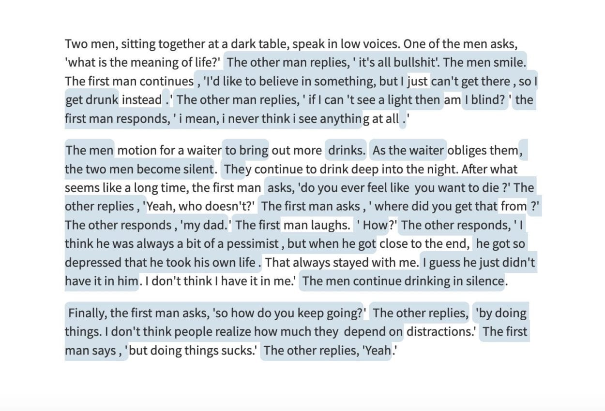
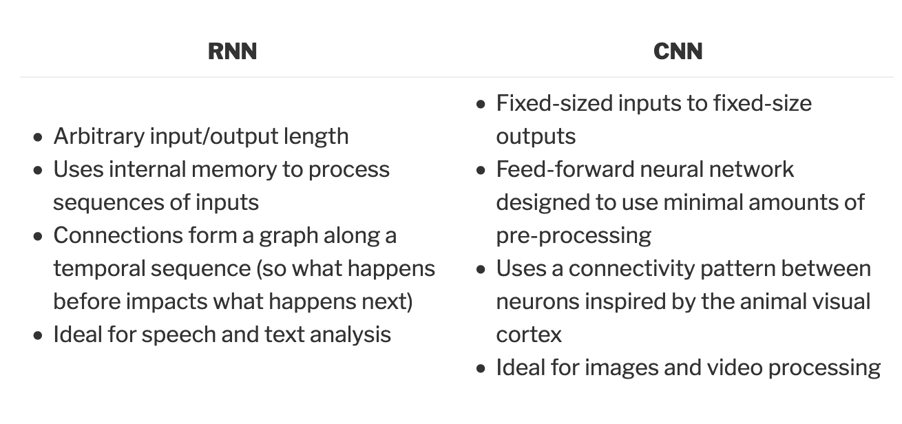

## Story Maps
Machine Learning for New Interfaces Final Project  
NYU Shanghai Fall 2019

__Note:__ The training and model files were too large to upload to GitHub, so they can be found here instead — [Story Maps Google Folder](https://drive.google.com/drive/folders/1LsG5-jHpRSwSQOoFk4m_hSbBvp7hwdaR?usp=sharing)

### Concept
A machine learning powered tool for creative writing.

### Ideation

For this project, I knew I wanted to develop something that would broaden my understanding of building and training models. I also wanted to develop a tool as opposed to a personal creative project because I have been so inspired by all the potential applications of machine learning for creative purposes that I wanted to work on something that could make those applications more accessible. I found a lot of inspiration in Google Creative Lab's [experiments in digital writing tools](https://experiments.withgoogle.com/collection/aiwriting). As a writer, It is sometimes very hard to find inspiration or move past writing blocks and I think machine learning could easily remedy this. Initially, I wanted to create a web based application where you input certain parameters like genre and gender of main character, and then have a discussion with your character based on a predictive text model trained on various literary texts. It was important to me to have the model trained on literary text as opposed to general English text because this project also stemmed from a writing exercise I was once given. In the exercise I was given a single line from a random poem or novel and then asked to write a variation underneath and build a full piece off of those first two lines. I thought looking at other literary work would inspire more interesting output and need less semantic association processing.

### Development Process

The first step in my process was to do a lot of research into language models. I read a lot about GPT-2, a large-scale unsupervised language model which generates coherent paragraphs of text from Open AI, and tested it out using [hugging face transformers](https://transformer.huggingface.co/). This is a screenshot of the output, the blue text was generated by GPT-2.

I thought this output was incredible for a machine learning model. It was able to track characters and develop a cohesive scene. I wanted to utilize the model, but realized I would have to develop something similar to hugging face using PyTorch. I found a [guide](https://www.analyticsvidhya.com/blog/2019/07/openai-gpt2-text-generator-python/) on how to do this specifically for GPT-2, but I wanted this project to use an ml5 framework. So, instead I decided to look into training my own, smaller model. I found this [github repository](https://github.com/Paperspace/training-lstm) that provided a framework for training Long Short Term Memory (LSTM) networks for use with tensorflow.js and ml5, but I wanted to understand the process and adapt my own code instead of copying it so I used it as a foundation for my research instead.

In my research, I learned about [N-grams](https://en.wikipedia.org/wiki/N-gram) which is a sequence of n tokens (or words). An N-gram language model predicts the probability of a given N-gram within any sequence of words in the language. With an __N-gram__ model, you can predict the probability of seeing the word __W__ given a history of previous words __H__ where the history contains __n-1__ words. This can be summarized as __p(w | h)__.

To initiate this process and construct the model, you first have to estimate the probability that will be used to generate output using the [chain rule of probability](https://www.youtube.com/watch?v=Zxm4Xxvzohk).

`p(w1...ws) = p(w1) . p(w2 | w1) . p(w3 | w1 w2) . p(w4 | w1 w2 w3) ..... p(wn | w1...wn-1)`

But because we do not know the conditional probabilities, we have to assume:

`p(wk | w1...wk-1) = p(wk | wk-1)`

Here, we are using the Markov assumption to approximate the history (context) of the word __wk__ by looking only at the last word of the context.

Once I understood this, I did more research into neural language models. There are two main types of neural networks that came up in my research, Recurrent Neural Networks (RNN) and Convolutional Neural Networks (CNN).

__Key Differences Between RNN and CNN:__

Based on these differences, I decided to use an RNN. LSTM networks, used in the github example I shared above, are a recurrent neural network that can develop temporal context and allow information to be passed from one step of the network to the next.

From here, I looked back to this [repo](https://github.com/Paperspace/training-lstm) and began to put together my own python files. The github repo was somewhat hard to understand at first because I did not understand the file framework and how everything related to one another, but the prior research I did helped a lot. I was able to see how they parsed through a plain text file to separate N-grams and then use that to run through training. This made the file framework clearer to me and I was able to replicate it more easily.

Next, I compiled my text corpus. Finding the novels I wanted to train the model on was actually quite hard because I was not sure what style to go with. I wanted a large variety, but also something somewhat cohesive. I looked through collections of science fiction books, poems, books by Ernest Hemingway and anything I could find online. Eventually, I decided to go with a collection of British fiction (Jane Austen, Emily Bronte, Charles Dickens, etc). The resulting plain text file was 507218 lines long (35.7 MB).

To train the model, I first ran the files on my own computer, but it was such a heavy job that it crashed almost instantly. Instead I used the school’s HPC with the help of a friend who had access to it. Using the HPC was incredibly exciting, but I still had to limit my expectations because I did not want to wait days for my model to train. So I decided to run small jobs one at a time to find my text limit. The first model was trained on only 7000 lines of text (459 KB), the second was 25000 lines (2.1 MB), the third was 100000 lines (7.4 MB) and the final model was trained on 250000 lines (16 MB). The final model took about 12 hours to train over 50 epochs.

Once I had my model, I wanted to use it in conjunction with ml5’s charRNN and adapt [Universal Sentence Encoder](https://github.com/tensorflow/tfjs-models/tree/master/universal-sentence-encoder) to be able to predict full sentences and not just the next character. I tried this without much success. From there I tried to train my own ml5 Word2Vec model and use Word2Vec, my LSTM and sentence encoder together but I still had a lot of trouble implementing this and reverted back to using charRNN with my LSTM model.

The outcome was somewhat of a broken predictive text application, because my model was also not as advanced as I hoped it would be. I was not able to use my more robust models because they were so big that they made the page lag noticeably. This was disappointing because the larger models were more accurate and produced actual words, where as the smaller models were faster but less coherent.

In terms of interface, I wanted to design a more aesthetically pleasing version of hugging face transformers. So I kept the central text box area, but made it smaller (and resizable). I also used a black, white and gray color scheme. In the background of the page I added a particle system. Initially, I wanted the particle system to update every time text was entered into the text area, so that you would see a word map of what you had written develop as you write. I thought this was a nice nod to the idea of building meaning and semantic association, as well as the RNN framework that the model looped through. However, I had to make the particles into ellipses because the text caused a lot of lag and freezing.

### Challenges

- I was not able to make the Universal Sentence Encoder work for ml5 which resulted in a very bad predictive text application instead of an application that could return coherent sentences
- The inability to use the larger models I trained due to lag
- Realizing too late that I should have trained a model to use with Word2Vec instead of charRNN so that I could develop semantic association

### Future Development

I definitely want to continue working on this. I think if I can figure out how to implement the sentence encoder with ml5, it would fix the text generation problem. I would also want to test this framework out with Word2Vec instead of charRNN and compare my results. I want to figure out how I can use a larger model without breaking my page. I also want to train a better model on different text because I was unhappy with the results of the text corpus I chose. Ideally, I would have multiple models trained on different genres, and you could select which genre you were interested in.

### Additional Sources that Saved my Life
- Statistical Machine Translation by Philipp Koehn, [Chapter 7: Language Models](http://www.statmt.org/book/slides/07-language-models.pdf)
- [Understanding LSTM Networks](https://colah.github.io/posts/2015-08-Understanding-LSTMs/)
- Deep Learning for NLP: [Language Modelling and Text Generation using LSTMs](https://medium.com/@shivambansal36/language-modelling-text-generation-using-lstms-deep-learning-for-nlp-ed36b224b275)

